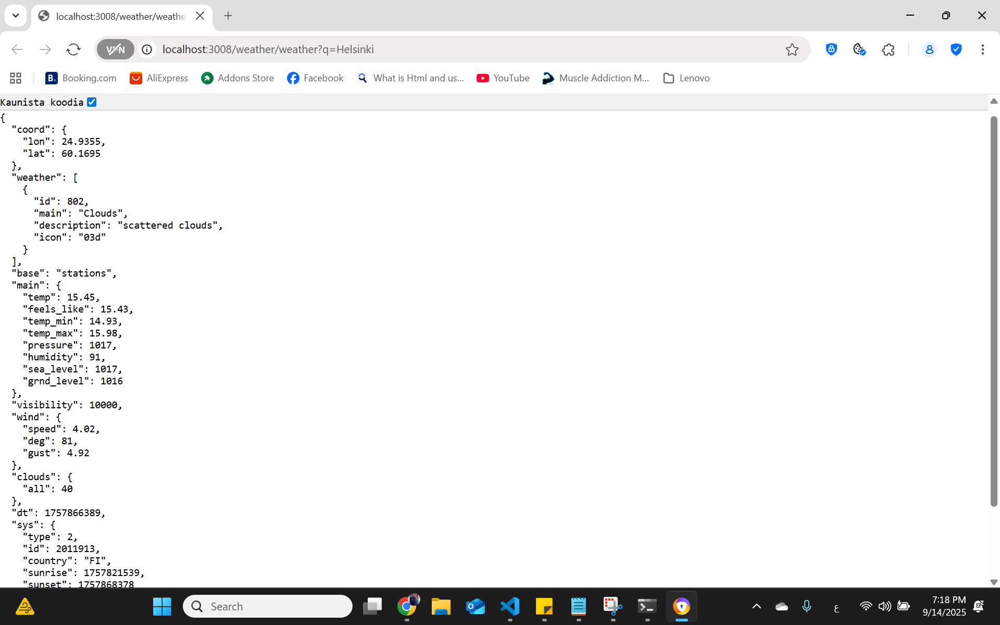
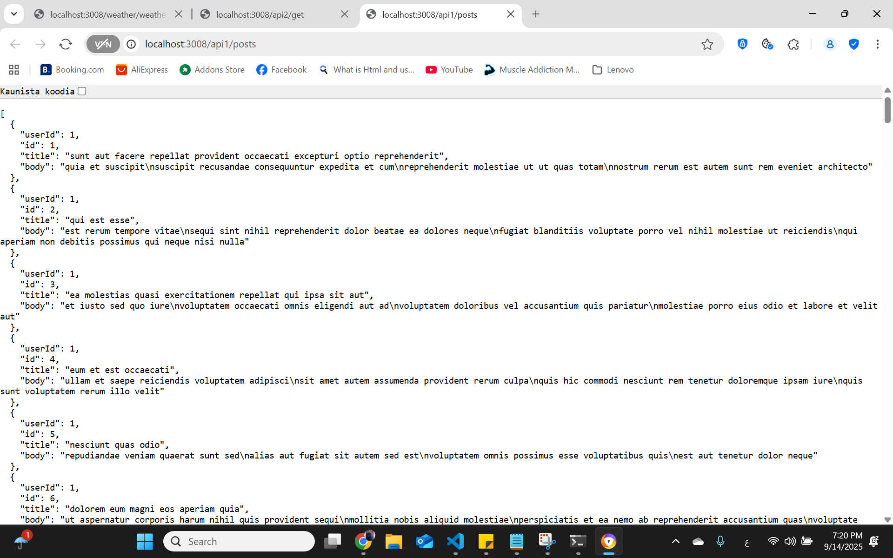

# Node.js API Gateway (Express + http-proxy-middleware)
_Updated: 2025-09-14_

**هدف المشروع (باختصار وبسهولة):**
بوابة API بسيطة بـ **Node.js + TypeScript**. عندك ثلاث مسارات Proxy:
- `GET /api1/*` → يوجّه إلى **jsonplaceholder.typicode.com**
- `GET /api2/*` → يوجّه إلى **httpbin.org**
- `GET /weather/*` → يوجّه إلى **OpenWeatherMap** ويضيف `appid` تلقائيًا من `.env`

> ملاحظة: لا يوجد مسار `health`، حسب الطلب.

---

## ✅ المتطلبات (Prerequisites)
- Node.js (LTS) + npm
- اتصال إنترنت (للوصول إلى APIs العامة)
- إنشاء ملف `.env` في جذر المشروع

---

## 🧱 هيكل بسيط (Structure)
```
api-gateway-node/
├─ src/
│  └─ server.ts
├─ .env              # محلي فقط (لا ترفعه على Git)
├─ .env.example      # مثال بدون معلومات حساسة
├─ package.json
├─ tsconfig.json
└─ README.md
```

---

## ⚙️ الإعداد السريع (Setup)
1) ثبّت الحزم (إن لم تكن مثبتة بالفعل):
```bash
npm install
```
2) أنشئ `.env` وضع مفتاح OpenWeatherMap الخاص بك:
```
PORT=3008
WEATHER_API_KEY=YOUR_OPENWEATHERMAP_KEY
```
> لا ترفع `.env` إلى Git. استخدم `.env.example` للمشاركة مع الفريق.

3) تشغيل في وضع التطوير:
```bash
npm run dev
```
أو للبناء والتشغيل كإصدار:
```bash
npm run build
npm start
```

---

## 🔗 الـ Endpoints (اختبار سريع)
> **Windows PowerShell**: استخدم `curl.exe` وليس `curl` لتجنب Alias.

- **API 1** (JSONPlaceholder):
  - Browser: `http://localhost:3008/api1/posts`
  - PowerShell:
    ```powershell
    curl.exe "http://localhost:3008/api1/posts"
    ```

- **API 2** (httpbin):
  - Browser: `http://localhost:3008/api2/get`
  - PowerShell:
    ```powershell
    curl.exe "http://localhost:3008/api2/get"
    ```

- **Weather** (OpenWeatherMap) – يضيف `appid` تلقائيًا:
  - Browser: `http://localhost:3008/weather?q=Helsinki`
  - وأيضًا يعمل: `http://localhost:3008/weather/weather?q=Helsinki`
  - PowerShell:
    ```powershell
    curl.exe "http://localhost:3008/weather?q=Helsinki"
    ```

> المسار النهائي الذي يرسله الجيتواي إلى OWM يكون مثل:
> `/data/2.5/weather?q=Helsinki&appid=***&units=metric`

---

## 🛠️ سكربتات npm
```json
{
  "scripts": {
    "dev": "tsx watch src/server.ts",
    "build": "tsc -p tsconfig.json",
    "start": "node dist/server.js"
  }
}
```

---

## 🧪 ملاحظات مهمة (Troubleshooting)
- **PowerShell يكسر السطر قبل `?q=`** → سيؤدي إلى `{"cod":"404","message":"Internal error"}`.  
  الحل: اجعل الرابط **سطر واحد** أو استخدم المتصفح.
- **OWM 401 (Invalid API key)** → المفتاح غير صحيح أو منتهي. حسّن `.env` ثم أعد تشغيل السيرفر.
- **OWM 404 (Internal error)** → غالبًا المسار كان خاطئ. الكود الحالي يصلّح المسار دائمًا بإدخال `/data/2.5` تلقائيًا.
- **TLS/SSL مشكلة مع خدمات داخلية** → مؤقتًا استخدم `secure: false` ضمن إعداد البروكسي لتلك الخدمة (فقط محليًا).
- **SELinux/Firewall على سيرفر لينكس**: افتح المنافذ (مثال 3008) وتفعيل `httpd_can_network_connect` إن استخدمت عكوس (Reverse proxy) مع Apache/Nginx.

---

## 🔐 أمان (Security)
- لا ترفع `.env` إلى المستودع.
- بدّل مفتاح OWM بشكل دوري إذا تم مشاركته.
- في الإنتاج: استخدم HTTPS أمام الجيتواي (NGINX/Apache أو Load Balancer).

---

## 🖼️ لقطات (Screenshots)





